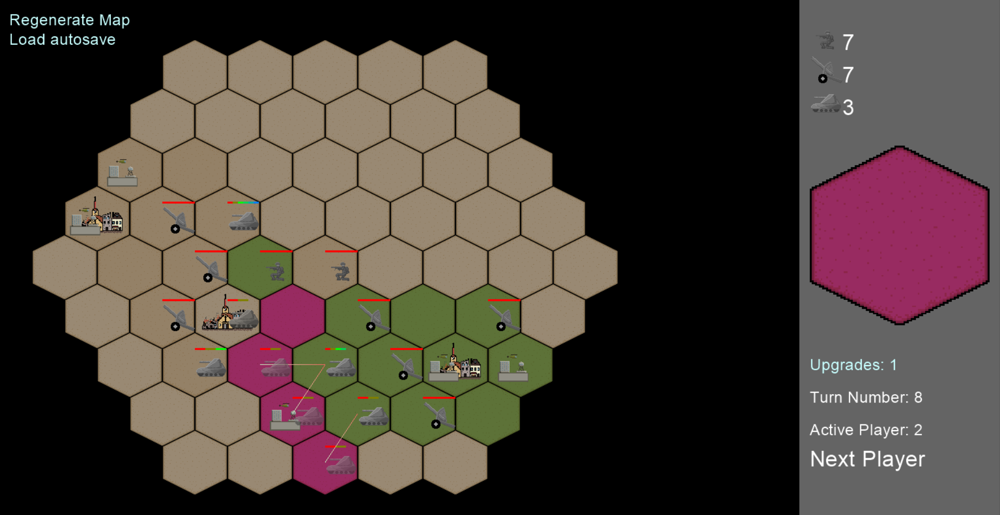

# Source_of_Power
Simple tabletop style turn-based strategy game. (not finished)

(AI does not exist yet so you'll have to play local multiplayer with other humans or with yourself)

Conquer your assigned region by seizing all sources of materials for your overlords!

The game features three unique unit types made to counter each other naturally:
- Tank: High hp, good for seizing bases and defending the artillery
- Artillery: Low hp, but two tiles of range so it can destroy enemies from afar
- Infantry: Low hp, but double movement speed and dropoff ability to let it sneak behind enemy lines and destroy weaker targets

Source of Power is unique by its
- Unit reserve system: You can send more troops everytime you destroy enemies' units. This enables for interesting exchange strategies.
- All units move at the same time: Players only issue orders, which are all evaluated at the end of the turn. No player gets an advantage by being first. For the exact algorithm, please look at **Unit movement** in **Quick manual**.

Pyglet is needed to run the game (`pip install pyglet` in the console/terminal)  
The "packages" folder only contains my own scripts for the base program.

I may make a proper documentation if any interest is expressed

Illustrative screenshot:

### Quick manual:
Main map settings (only side lengths and win/lose conditions) are currently always defined at around line 300 (starting with `Map = MapHex( `).

The map can be navigated by dragging with the mouse wheel (press and hold). You can zoom in and out by rotating the mouse wheel.

There is always allowed only one unit per tile.

#### Turn 0:
You can modify your map in setup phase (turn 0) by pressing **u** for **upgrade**, **p** for **player's starting base** or **s** for **source** (currently looks like a village) to set the tile feature that you want to place and then left-click on a tile to place it. Tile features can be removed with right-clicking.

Placing/removing a starting base will automatically create/delete a player. You can use that to make a new color for yourself if you don't like it.

There is also a possibility to change the number of reserve units and upgrades that each player receives (left/right click to increase/decrease)

#### Units:
All the units can deal 1 damage per attack in their normal form, but they can be upgraded (wrench tile) to have double HP and damage.

Unit will loose its upgrade once its HP gets to the original value or lower. The lost upgrade then returns to the unit's owner.

A killed troop will go to the reserve of the player who dealt most damage to it (in the current turn)
##### Tank:
- 3 HP
- 1 movement point
- 1 tile of attack range
##### Artillery:
- 1 HP
- 1 movement poin
- 2 tiles of attack range
##### Infantry:
- 1 HP
- 2 movement points
- 1 tile of attack range
- Dropoff ability (can get transported to up to double the distance of its normal movement if it is standing on a friendly base)

#### Controls:
##### Universal:
Anything can be deselected by hitting **Spacebar**

The map can be navigated by dragging with the mouse wheel (press and hold). You can zoom in and out by rotating the mouse wheel.
##### Unit spawning:
You can spawn a new unit by selecting the type you want on the upper right side of the screen and then clicking on a free base owned by you.
A spawned unit can be removed by right-clicking.
##### Issuing orders:
Select a unit by left-clicking it, blue (move) or red (attack) tiles will pop up around it. Move/Attack mode can be switched ba pressing 'a' on the keyboard. You can click on one of them to order the unit to go there. Orders will be evaluated all at once at the end of the turn.

#### Unit movement:
##### Move orders:
Each time a move order is issued, the unit 'requests' the target tile. There are two types of requests: *stay-there* and *go-through*, *stay-there* is tile-exclusive (all other *stay-there*s get canceled, or this one gets canceled, or both). *Go-through* exists just to mark the path of the unit so that it can try to fall back if it can't get to its final destination.

Unit that doesn't move during the turn cancels all other *stay-there* requests on its tile.

***Stay-there* exclusion sequence**
- The player with most *stay-there*s for a tile will cancel the others. (all get canceled if two or more biggest groups are of the same size)
- The *stay-there* that was requested first will cancel the others *of the same player*.

In the case when unit's *stay-there* request gets canceled: The unit will fall back until it either stands on an empty tile or returns to its original position, where it will cancel all other *stay-there*s, forcing them to fall back as well.

##### Attack orders:
Units will fire on the ordered **tile** if they'll be able to get to the firing position (last *move* order).

Now we focus on the **tile** part: Attacks in this game work like if the tile was under continuous fire through the whole turn, so every unit that starts, ends, moves or everything at once on/through *this* tile will receive full damage, no matter for how short of a timespan it was there.
